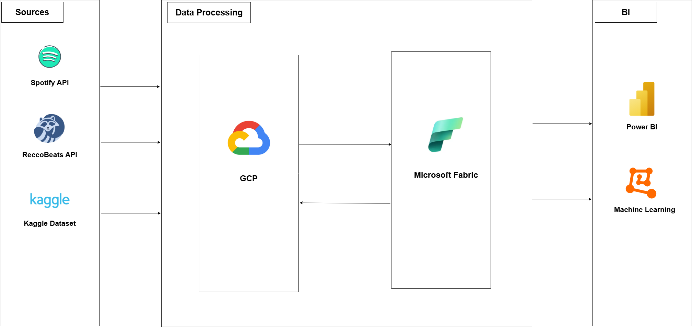
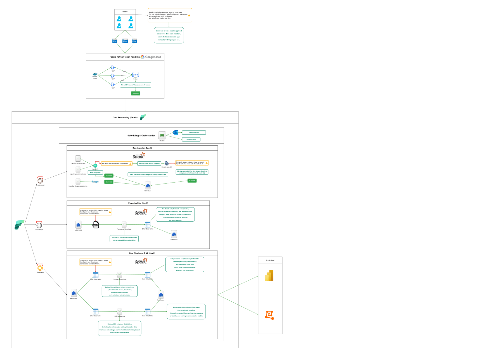
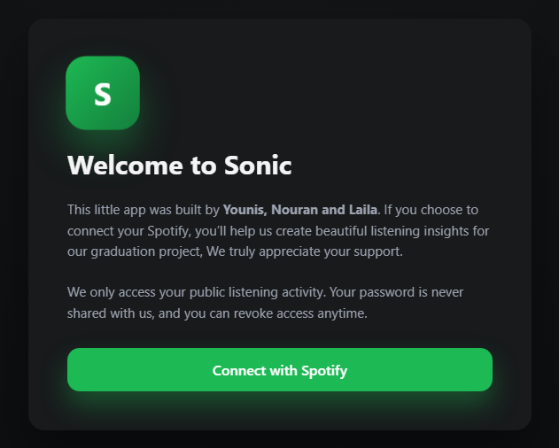
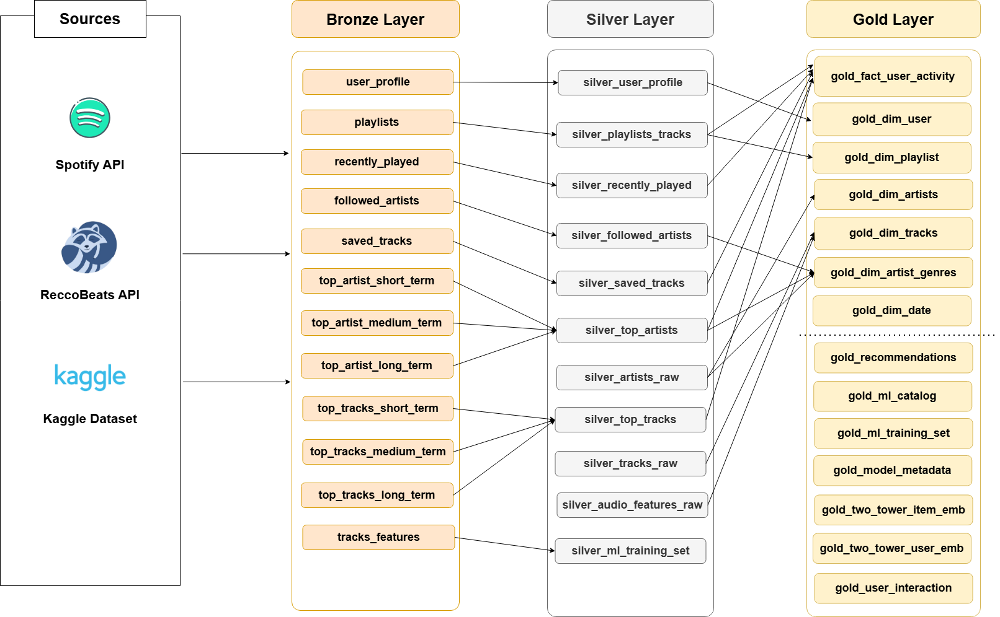
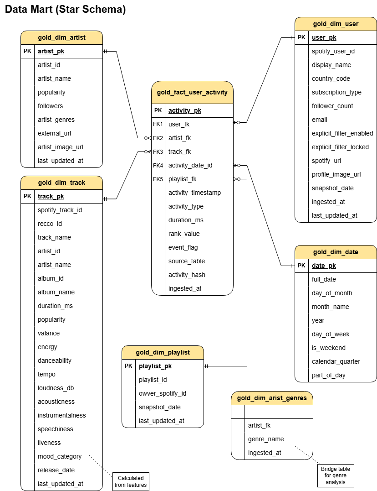
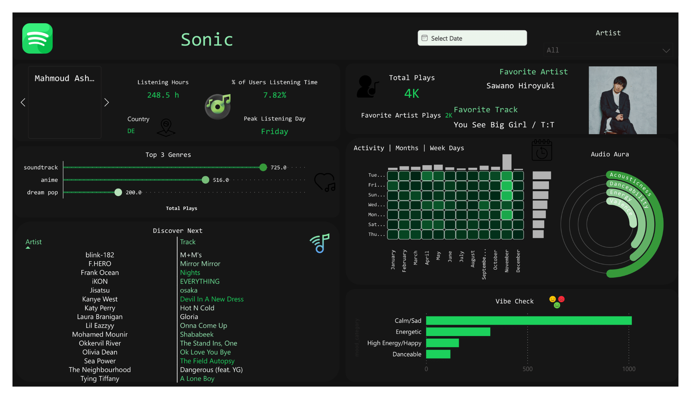

**_**# **SONIC**

### **A Hybrid Cloud Platform for Spotify Analytics & ML Recommendations**

## **\[ PROJECT GENESIS \]**

Most music streaming users anticipate their "Spotify Wrapped" at the end of the year to visualize their listening statistics and share them socially. However, this feature is temporally limited; users cannot access these insights on-demand (e.g., in May) or view granular analysis for specific recent periods like the previous week.

**Sonic** was engineered to solve this limitation. It is a production-grade data platform that provides on-demand analysis for users. Beyond simple statistics, Sonic leverages Machine Learning to understand a user's musical taste based on the **acoustics and "physics" of the music itself** (audio features like energy, valence, and danceability) rather than relying solely on surface-level metadata like Genres or Artists.

The system performs deep behavioral analysis—introducing concepts like "Vibe Checks" and "Audio Auras"—and delivers recommendations derived from a massive pool of 1.2 million songs. To support this scale, the project moved beyond local scripts to a **Hybrid Cloud Architecture**, utilizing **Google Cloud Platform (GCP)** for high-concurrency frontend ingestion and **Microsoft Fabric** for a scalable Data Lakehouse and Apache Spark processing engine.

## **\[ SYSTEM ARCHITECTURE BLUEPRINT \]**

The system relies on two major powerhouses: **GCP** for the User Interface and Ingestion, and **Microsoft Fabric** for the Factory (Processing & ML).

The data journey begins with the user interacting with our frontend applications. Data flows through a multi-stage pipeline:

1. **Ingestion (GCP):** Users authenticate via a load-balanced multi-app architecture.  
2. **Lakehouse Processing (Fabric):** Data moves through a **Medallion Architecture**:  
   * **Bronze Layer:** Raw data ingestion.  
   * **Silver Layer:** Cleaning, flattening, and deduplication.  
   * **Gold Layer:** Business-ready Star Schema for Power BI and ML tables.  
3. **Consumption:** Deep analysis dashboards and ML-driven recommendations.

## **\[ CORE DIRECTIVES \]**

* **Hybrid Cloud Ingestion:** Strategically leverages GCP Cloud Run for scalable, serverless frontend applications while using Microsoft Fabric for heavy data processing.  
* **Medallion Lakehouse Architecture:** Strict separation of concerns (Bronze/Raw, Silver/Clean, Gold/Business) ensuring data quality and lineage.  
* **API Limit Circumvention:** Implements a multi-app "load balancing" strategy to triple the daily user invitation limit imposed by Spotify's developer policy.  
* **Data Enrichment Bridge:** Overcomes the depreciation of Spotify's Audio Features endpoint by cross-referencing metadata with the RecoBeats API and external datasets.  
* **Machine Learning Integration:** Embeds ML training and inference directly within the data pipeline using Spark-based LightGBM and Vector Similarity Search.  
* **Automated Orchestration:** Utilizes Fabric Data Pipelines for end-to-end automation with integrated failure alerting for Data Engineers.  
* **Secure Credential Management:** Strict security protocols using Azure Key Vault and GCP Secret Manager to handle API keys and User Tokens.

## **\[ TECHNOLOGY MATRIX \]**

| Category | Technology / Service | Purpose |
| :---- | :---- | :---- |
| **Cloud Platforms** | Microsoft Fabric, GCP, Azure | Core Lakehouse infrastructure and hybrid ingestion components. |
| **Compute & Processing** | Spark (Fabric Notebooks) | Distributed data processing for ETL and ML training. |
| **Ingestion Frontend** | GCP Cloud Run | Hosting the OAuth applications for user token capture (FastAPI \+ Docker). |
| **Data** Storage | OneLake (Delta Lake) | Unified storage layer for Bronze, Silver, and Gold tables. |
| **External Data** | Kaggle, RecoBeats API | Supplementing missing audio feature data for model training. |
| **Machine Learning** | LightGBM, Annoy | Ranking algorithms and Approximate Nearest Neighbor search. |
| **Orchestration** | Fabric Data Pipelines | Automating the sequential execution of notebooks. |
| **Security** | Azure Key Vault, GCP Secrets | Managing Admin keys and User Refresh Tokens securely. |
| **Visualization** | Microsoft Power BI | Interactive dashboards for user behavior and recommendations. |

## **\[ THE INGESTION LAYER: GCP CLOUD RUN \]**

### **The "User Cap" Challenge**

A significant hurdle during development was the **Spotify** Developer User **Cap**. Spotify's policy restricts applications in "Development Mode" to only 25 distinct users. For a project intended to be tested by a wider cohort (classmates, faculty, friends), this was insufficient.

### **The Multi-App Solution**

To bypass this, we architected a **Multi-App Load Balancing** system. We deployed **three identical versions** of our Authorization Service on Google Cloud Run. Each service corresponds to a distinct Spotify Developer App with its own Client ID.

(While the System Architecture diagram displays three distinct OAuth services (spotify-oauth-gcp-1, 2, 3), they share identical source code, to maintain a clean repository (DRY Principle), this repo contains a single instance of the Authorization Service.)
* Users are distributed manually across these three links (App 1, App 2, App 3).  
* This effectively tripled our capacity.

### **Workflow & Security**

The service is built with **FastAPI** running inside a **Docker Container**.

1. **Authentication:** When a user logs in, the system does not store passwords. Instead, it captures the **Refresh Token**.  
2. **Secret Storage:** These tokens are strictly sensitive. We utilize **GCP Secret Manager** to store them. No tokens are stored in a standard database; Secret Manager provides the necessary security compliance for this sensitive data.  
3. **User Experience:** The user is presented with a clean interface. Upon agreeing to the scope (reading public listening history), they receive a "You are all set" confirmation, signaling their token is secured in GCP and ready for the data pipeline.

## **\[THE DATA PROCESSING CORE: FABRIC NOTEBOOKS\]**

Once credentials are secured in Google Cloud, the process shifts to Microsoft Fabric to implement the Medallion Architecture.

### **1\. Ingestion (Bronze Layer) & The Data Bridge**

We utilize Spark Notebooks to fetch data. However, we encountered a critical issue: **Spotify deprecated the Audio Features Endpoint**, which was essential for our "physics-based" analysis.

The Solution: Data Bridge Strategy  
We built a data bridge using an external API called RecoBeats.

1. We pull song IDs from Spotify.  
2. Since RecoBeats requires its own internal ID, we first query a Metadata endpoint to map the Spotify ID to a RecoBeats ID.  
3. Using the RecoBeats ID, we fetch the acoustic features (Danceability, Energy, Valence, etc.).

External Datasets  
To ensure our Machine Learning model had a sufficient training pool (beyond just the user's data), we ingested a Kaggle Dataset containing 1.2 Million Songs. This allows the model to recommend tracks the user has never heard before, based purely on acoustic similarity.  
File Level Data Lineage  
Data is stored in a structured hierarchy:  
User Folder \-\> Data Type (Recently Played/Artists) \-\> Date \-\> JSON File.

### **2\. Transformation (Silver Layer)**

Raw data arrives as complex, nested JSON files (arrays inside arrays). In this layer, we transform the data into a clean, queryable format using PySpark.

* **Flattening:** deeply nested JSON structures are flattened into tabular formats.  
* **Cleaning:** Irrelevant columns (e.g., list of 50+ available market regions) are dropped to optimize storage.  
* **Deduplication:** We remove duplicate entries to ensure data integrity.  
* **Output:** Clean Delta Tables for Saved Tracks, Recently Played, Top Artists, and Profiles.

### **3\. Modeling (Gold Layer)**

Here, data matures into a **Star Schema** optimized for analytics.

* **Dimensions & Facts:** We define entities like User, Artist, Track, and Playlist.  
* **Referential Integrity:** We handle "Unknown" rows to prevent data loss during Joins (e.g., if a Foreign Key is null, it maps to a predefined "Unknown" row in the Dimension table).  
* **User Activity Fact Table:** This central table aggregates all user actions (saves, plays, playlist additions) into a single timeline.  
* **ML Preparation:** Specific tables are created purely for the Machine Learning model, distinct from the BI reporting tables.

## **\[ INTELLIGENCE & RECOMMENDATIONS \]**

### **The "Physics" of Music**

Unlike standard recommenders that rely on "People who liked this also liked...", Sonic focuses on the **Acoustic Physics** of the audio. We analyze features such as:

* **Acousticness:** Is the track purely instrumental/natural or electronic?  
* **Valence:** The musical positiveness (Happy vs. Sad).  
* **Energy:** Intensity and activity measures.

### **ML Implementation**

We utilized a **LightGBM Ranker** combined with an **Annoy (Approximate Nearest Neighbors)** index.

1. **Classification:** The model classifies songs from the 1.2M Kaggle pool.  
2. **Scoring:** It assigns a probability score (0 to 1\) indicating how likely a specific user is to enjoy a track based on their acoustic history.  
3. **Result:** A list of "Discover Next" tracks that mathematically align with the user's specific audio aura.

## **\[ ORCHESTRATION & AUTOMATION \]**

The entire pipeline is automated using **Fabric Data Pipelines**.

* **Schedule:** The pipeline triggers automatically every day at 9:00 AM.  
* **Monitoring:** If any activity (Ingestion, Silver Processing, ML Training) fails, the system triggers an automatic email alert detailing the specific error and stage.  
* **Direct Lake:** The Gold Layer is connected to Power BI via **Direct Lake** mode. This simulates a streaming experience; as soon as data is processed in the Lakehouse, it is instantly available in the dashboard without requiring a manual refresh.

## **\[ ANALYTICS & VISUALIZATION \]**

The Dashboard serves as the visual backbone of the project, offering deep analysis rather than surface-level metrics. Due to Spotify's API limitations (e.g., only 50 recently played tracks accessible at a time), this dashboard represents a demo of what is possible with a robust data platform.

**Key Visuals:**

* **Audio Aura:** A visualization showing the user's dominant musical characteristics (e.g., High Danceability vs. High Acousticness).  
* **Vibe Check:** categorization of listening history into moods (Calm, Energetic, Depressing).  
* **Favorite Artist Analysis:** Displays the user's top artist within the captured dataset window, along with their most played track by that artist.  
* **Discover Next:** A list of 15 recommended songs generated by the ML model. A confidence score of \>0.7 indicates a high-quality match.

## **\[ TACTICAL SOLUTIONS: CHALLENGES OVERCOME \]**

| Challenge | Solution |
| :---- | :---- |
| **Developer User Cap (25 Users)** | deployed a **Multi-App Load Balancing** architecture. Three distinct Spotify Applications run simultaneously on Cloud Run. Each team member uses a dedicated app instance to invite users, effectively tripling the daily onboarding throughput. |
| **Deprecation of Audio Features Endpoint** | Engineered a **Data Bridge Strategy**. Instead of relying solely on Spotify, we integrated the **RecoBeats API** to fetch acoustic data. This required a multi-step lookup (Spotify ID \-\> Metadata \-\> RecoBeats ID \-\> Audio Features). |
| **Data Scarcity & Cold Start** | Utilized a **Hybrid Training Approach**. The model is pre-trained on a massive **Kaggle dataset (1.2M songs)** to learn general relationships between audio features. This allows the system to recommend music even if the user's personal data is limited. |
| **Data Quality** | Implemented rigorous cleaning in the Silver Layer to handle inconsistent JSON schemas and missing values, ensuring the Gold Layer receives only high |

## **\[ VIDEO EXPLAINING THE PROJECT (ARABIC) \]**

**\[** [https://youtu.be/FClotxrx8F0?si=LPChkQOAVfUgeHZJ](https://youtu.be/FClotxrx8F0?si=LPChkQOAVfUgeHZJ) **\]**

**_**